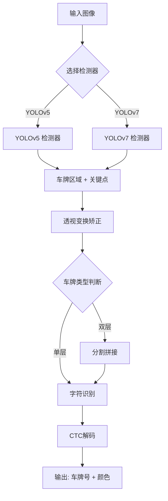

# PlateRecognition_ncnn
[](https://www.linux.org/) [](https://github.com/Tencent/ncnn) [](https://opencv.org/) [](https://claude.ai/chat/LICENSE)

基于 NCNN 深度学习框架的高性能中文车牌检测与识别系统，支持单层和双层车牌识别，可在 CPU 和 GPU 上高效运行。（移植自项目[PlateRecognition](https://github.com/pcb9382/PlateRecognition))

## 📋 目录

- [系统架构](https://claude.ai/chat/9ab72285-9679-427c-bbc4-7105acf0dd83#-系统架构)
- [核心模块](https://claude.ai/chat/9ab72285-9679-427c-bbc4-7105acf0dd83#-核心模块)
- [功能特性](https://claude.ai/chat/9ab72285-9679-427c-bbc4-7105acf0dd83#-功能特性)
- [环境依赖](https://claude.ai/chat/9ab72285-9679-427c-bbc4-7105acf0dd83#-环境依赖)
- [快速开始](https://claude.ai/chat/9ab72285-9679-427c-bbc4-7105acf0dd83#-快速开始)
- [使用说明](https://claude.ai/chat/9ab72285-9679-427c-bbc4-7105acf0dd83#-使用说明)

------

## 🏗️ 系统架构



**处理流程：**

1. **检测阶段**：使用 YOLOv5 或 YOLOv7 定位车牌位置和4个关键点
2. **矫正阶段**：基于关键点进行透视变换，获得标准视角
3. **预处理**：双层车牌需要分割上下两层并水平拼接
4. **识别阶段**：通过深度学习模型识别字符和颜色
5. **解码阶段**：CTC 解码去除重复字符，输出最终结果

------

## 🧩 核心模块

### 1. 车牌检测模块 - YOLOv5

**文件：** `platedetector_yolov5.h/cpp`

#### 功能说明

基于 YOLOv5 的车牌检测器，能够快速准确地定位图像中的车牌区域。

#### 核心特性

- ✅ **Letterbox 预处理**：保持宽高比的缩放 + 灰色填充（114）
- ✅ **多尺度检测**：输入尺寸 640×640，输出 25200 个候选框
- ✅ **关键点检测**：输出车牌4个角点坐标（左上、右上、右下、左下）
- ✅ **NMS 去重**：基于 IOU 阈值（0.5）的非极大值抑制
- ✅ **批量处理**：支持 OpenMP 多线程并行处理

#### 输出格式

```cpp
struct Detection_Yolov5 {
    float bbox[4];           // [x1, y1, x2, y2] - 边界框
    float class_confidence;  // 置信度
    int label;               // 0=单层车牌, 1=双层车牌
    float landmark[8];       // 4个关键点 [x0,y0, x1,y1, x2,y2, x3,y3]
};
```

#### 技术细节

- **输入张量**：`in0` - [1, 3, 640, 640]
- 输出张量: `out0` \- [25200, 15]
  - 前4维：bbox (cx, cy, w, h)
  - 第5维：objectness
  - 6-13维：landmark 坐标
  - 14-15维：类别概率
- **置信度计算**：`conf = objectness × max(class_prob)`
- **阈值设置**：prob_threshold=0.25, nms_threshold=0.5

------

### 2. 车牌检测模块 - YOLOv7

**文件：** `platedetector_yolov7.h/cpp`

#### 功能说明

基于 YOLOv7 的车牌检测器，提供更高的检测精度和更好的小目标检测能力。

#### 核心特性

- ✅ **自适应缩放**：等比例缩放后居中填充
- ✅ **关键点可见性**：输出包含关键点的可见性信息（x, y, visibility）
- ✅ **类别感知 NMS**：同类别目标才进行 IOU 计算
- ✅ **结构化输出**：使用 `PlateRect` 结构体和 `vector` 存储
- ✅ **并行推理**：支持 4 线程并行批量处理

#### 输出格式

```cpp
struct Detection_Yolov7 {
    PlateRect bbox;              // {xmin, ymin, xmax, ymax}
    int label;                   // 0=单层车牌, 1=双层车牌
    float confidence;            // 置信度
    std::vector<float> key_points; // 动态关键点数组 [x0,y0, x1,y1, ...]
};
```

#### 技术细节

- **输入张量**：`in0` - [1, 3, 640, 640]
- 输出张量：`out0` \- [N, M] (动态)
  - 前5维：[cx, cy, w, h, objectness]
  - 6-7维：类别概率 [cls0, cls1]
  - 8+维：关键点 [x0, y0, vis0, x1, y1, vis1, ...]
- **类别数量**：2（单层/双层）
- **关键点数量**：4个（提取 x,y 坐标，忽略 visibility）

### 3. 车牌识别模块

**文件：** `plate_recognition.h/cpp`

#### 功能说明

基于深度学习的车牌字符识别模块，同时识别车牌号码和颜色。

#### 核心特性

- ✅ **端到端识别**：一次推理同时输出字符和颜色
- ✅ **CTC 解码**：自动去除重复字符和空白符
- ✅ **多颜色支持**：识别黑、蓝、绿、白、黄5种车牌颜色
- ✅ **完整字符集**：支持78个字符类别
- ✅ **GPU 加速**：支持 Vulkan 加速推理

#### 字符集覆盖

```cpp
// 省份简称（31个）
"京", "沪", "津", "渝", "冀", "晋", "蒙", "辽", "吉", "黑", 
"苏", "浙", "皖", "闽", "赣", "鲁", "豫", "鄂", "湘", "粤", 
"桂", "琼", "川", "贵", "云", "藏", "陕", "甘", "青", "宁", "新"

// 特殊字符
"学", "警", "港", "澳", "挂", "使", "领", "民", "航", "危", "险", "品"

// 字母（24个，不含I和O）
A-Z (除 I, O)

// 数字（10个）
0-9

// 空白符
"#" (CTC空白符)
```

#### 颜色分类

```cpp
std::vector<std::string> plate_color_list = {
    "黑色",  // 0 - 使馆车、领馆车
    "蓝色",  // 1 - 普通小型车
    "绿色",  // 2 - 新能源车
    "白色",  // 3 - 军车、警车、特种车
    "黄色"   // 4 - 大型车、教练车
};
```

#### 技术细节

- **输入尺寸**：168×48 (resize后的车牌图像)
- 归一化参数:
  - `mean = 149.94` (RGB三通道)
  - `norm = 1/(0.193×255) ≈ 0.0207`
- 输出张量:
  - `out0`: [21, 78] - 字符识别输出（21个位置，78个类别）
  - `out1`: [5] - 颜色分类输出
- 解码算法:CTC (Connectionist Temporal Classification)
  - 跳过空白符（索引0）
  - 去除连续重复字符
  - 拼接最终车牌号

#### 识别流程

```python
输入车牌图像 (HxW)
    ↓
Resize 到 168×48
    ↓
归一化 (mean=149.94, norm=0.0207)
    ↓
NCNN 推理
    ├─→ out0 [21×78] → Argmax → CTC解码 → 车牌号
    └─→ out1 [5] → Argmax → 颜色
    ↓
输出：("京A12345", "蓝色")
```

------

### 4. 主控模块

**文件：** `plate_detection_recognition.h/cpp`

#### 功能说明

整合检测和识别模块，提供统一的车牌识别接口，处理完整的检测-识别流程。

#### 核心特性

- ✅ **智能指针管理**：使用 `unique_ptr` 自动管理资源
- ✅ **双层车牌处理**：自动分割并拼接双层车牌
- ✅ **透视变换**：基于4个关键点矫正车牌角度
- ✅ **批量识别**：支持多张图像批量处理
- ✅ **异常处理**：完善的错误检查和日志输出

#### 接口函数

```cpp
class PlateAlgorithm {
public:
    // YOLOv5 检测+识别
    int PlateRecognition_yolov5(Plate_ImageData* img, PlateDet* PlateDets);
    
    // YOLOv7 检测+识别
    int PlateRecognition_yolov7(Plate_ImageData* img, PlateDet* PlateDets);
    
private:
    std::unique_ptr<Detector_Yolov5plate> yolov5_plate;
    std::unique_ptr<Detector_Yolov7plate> yolov7_plate;
    std::unique_ptr<PlateRecognition> plate_recognition;
};
```

#### 输入输出格式

```cpp
// 输入图像
typedef struct {
    unsigned char* image;  // 图像数据指针
    int width;             // 宽度
    int height;            // 高度
    int channels;          // 通道数 (通常为3)
} Plate_ImageData;

// 输出结果
typedef struct {
    PlateRect bbox;            // 边界框
    int label;                 // 0=单层, 1=双层
    float confidence;          // 置信度
    float key_points[8];       // 4个关键点
    char plate_color[32];      // 车牌颜色
    char plate_license[32];    // 车牌号
    int plate_index;           // 车牌数量
} PlateDet;
```

#### 双层车牌处理算法

```cpp
cv::Mat get_split_merge(cv::Mat &img) {
    // 1. 分割上层（前5/12高度）
    cv::Rect upper_rect = cv::Rect(0, 0, img.cols, int(5.0/12 * img.rows));
    cv::Mat img_upper = img(upper_rect);
    
    // 2. 分割下层（后2/3高度）
    cv::Rect lower_rect = cv::Rect(0, int(1.0/3 * img.rows), 
                                   img.cols, img.rows - int(1.0/3 * img.rows));
    cv::Mat img_lower = img(lower_rect);
    
    // 3. 上层resize到与下层相同大小
    cv::resize(img_upper, img_upper, img_lower.size());
    
    // 4. 水平拼接
    cv::Mat out(img_lower.rows, img_lower.cols + img_upper.cols, CV_8UC3);
    img_upper.copyTo(out(cv::Rect(0, 0, img_upper.cols, img_upper.rows)));
    img_lower.copyTo(out(cv::Rect(img_upper.cols, 0, img_lower.cols, img_lower.rows)));
    
    return out;
}
```

#### 透视变换

基于检测到的4个关键点进行透视变换，将倾斜的车牌矫正为标准视角：

- 计算车牌的实际宽度和高度
- 定义标准矩形的4个角点
- 使用 `cv::getPerspectiveTransform` 计算变换矩阵
- 应用 `cv::warpPerspective` 进行矫正

------

## ✨ 功能特性

### 🎯 检测能力

- ✅ 单层车牌检测（蓝牌、黄牌、白牌等）
- ✅ 双层车牌检测（大型车辆、挂车等）
- ✅ 多车牌同时检测（最多10个）
- ✅ 小目标车牌检测（最小32×32像素）
- ✅ 倾斜车牌检测（±30度范围内）

### 📝 识别能力

- ✅ 完整字符识别（31省份+24字母+10数字+特殊字符）
- ✅ 颜色分类（黑、蓝、绿、白、黄）
- ✅ 新能源车牌支持（8位车牌号）
- ✅ 特殊车牌支持（警、学、使、领等）

### ⚡ 性能优化

- ✅ NCNN 轻量级推理引擎
- ✅ Vulkan GPU 加速
- ✅ OpenMP 多线程并行
- ✅ 内存池管理（减少分配开销）
- ✅ 批量处理优化

### 🛡️ 鲁棒性

- ✅ 异常处理机制
- ✅ 边界检查和裁剪
- ✅ 空指针保护
- ✅ 详细日志输出

------

## 🔧 环境依赖

### 系统要求

- **操作系统**：Linux (推荐 Ubuntu 18.04+)
- **编译器**：GCC 7.0+ 或 Clang 6.0+
- **CMake**：3.10+
- **CPU**：支持 SSE4.2 指令集
- **GPU**（可选）：支持 Vulkan 的显卡

### 依赖库

| 库名称 | 版本要求 | 用途             |
| ------ | -------- | ---------------- |
| OpenCV | 4.x      | 图像处理和可视化 |
| NCNN   | latest   | 深度学习推理引擎 |
| OpenMP | -        | 多线程并行       |
| Vulkan | 1.0+     | GPU 加速（可选） |

### 安装依赖

```bash
# Ubuntu/Debian
sudo apt-get update
sudo apt-get install -y \
    build-essential \
    cmake \
    libopencv-dev \
    libomp-dev \
    vulkan-tools \
    libvulkan-dev

# 编译安装 NCNN
git clone https://github.com/Tencent/ncnn.git
cd ncnn
mkdir build && cd build
cmake -DCMAKE_BUILD_TYPE=Release \
      -DNCNN_VULKAN=ON \
      -DNCNN_BUILD_EXAMPLES=OFF ..
make -j$(nproc)
sudo make install
```

------

## 🚀 快速开始

### 1. 克隆项目

```bash
git clone https://github.com/zhahoi/PlateRecognition_ncnn.git
cd PlateRecognition_ncnn
```

### 2.进入到不同的功能模块，编译项目

```bash
mkdir build && cd build
cmake ..
make -j$(nproc)
```

### 3. 运行示例

```bash
# 批量处理车牌号识别
./plate_recognition_app

# 使用yolov5进行车牌号批量检测
./yolov5_plate_app 

# 使用yolov7进行车牌号批量检测
./yolov7_plate_app

# 进行车牌号批量检测和识别
./plate_detection_recognition 
```

### 4.检测结果


------

## 📖 使用说明

### 切换检测器

在 `main.cpp` 中修改宏定义：

```cpp
// 使用 YOLOv5
#define USE_YOLOV7  0

// 使用 YOLOv7
#define USE_YOLOV7  1
```

### 自定义参数

修改各模块头文件中的参数：

```cpp
// YOLOv5/YOLOv7 检测器
const float prob_threshold = 0.25f;  // 置信度阈值
const float nms_threshold = 0.5f;    // NMS IOU阈值
const int target_size = 640;         // 输入尺寸

// 车牌识别
const int INPUT_W = 168;  // 识别输入宽度
const int INPUT_H = 48;   // 识别输入高度
```


### 写在后面

本项目是对[PlateRecognition](https://github.com/pcb9382/PlateRecognition)的移植适配，将其迁移到ncnn平台实现。本项目代码并非完全基于原项目代码风格实现，带有我个人的实现习惯。本项目的代码实现也依赖于各种大模型的调试，才能让我更快地实现该项目工程。感谢开源。


### Reference

-[PlateRecognition](https://github.com/pcb9382/PlateRecognition)

<div align="center">

⭐ 如果这个项目对您有帮助，请给一个 Star！⭐

Made with ❤️ by [zhahoi]